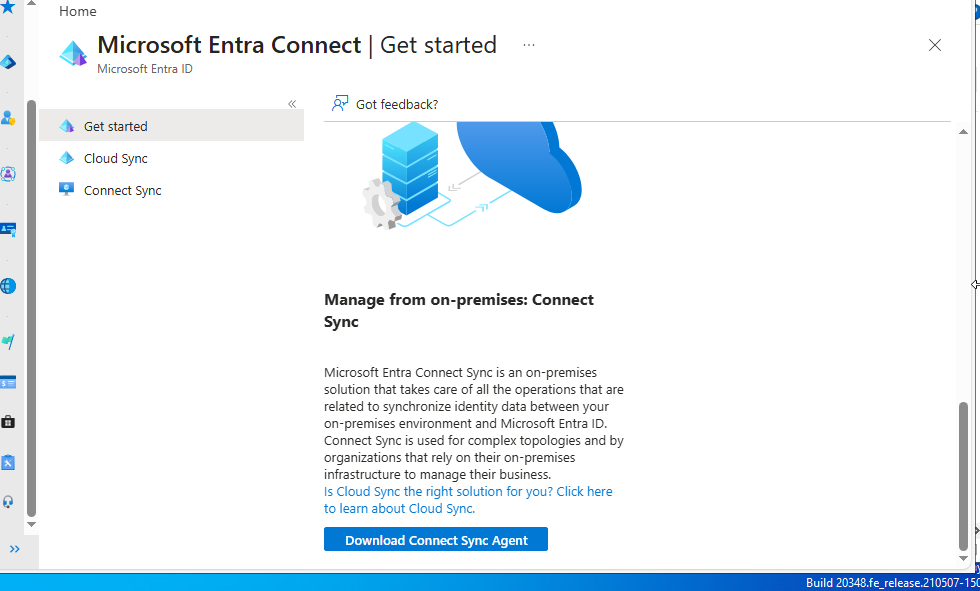
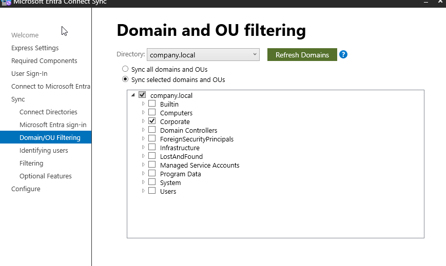
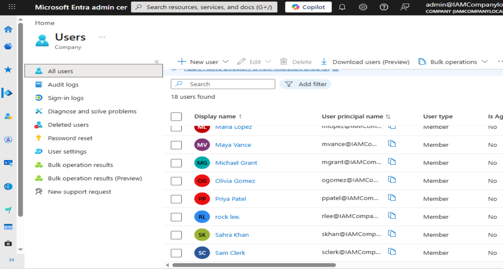
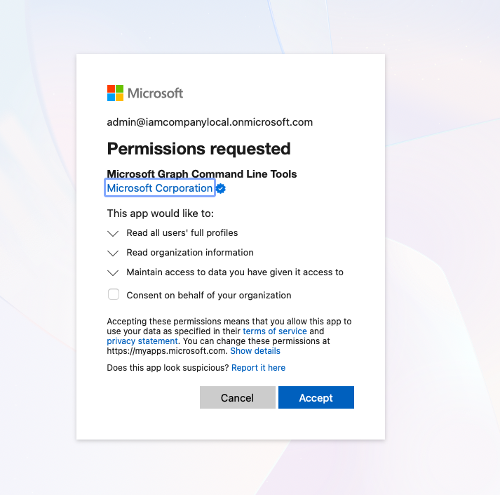
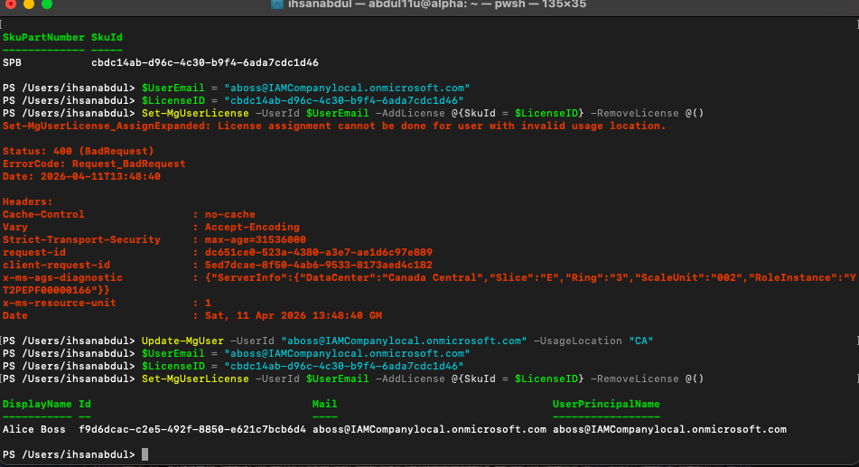
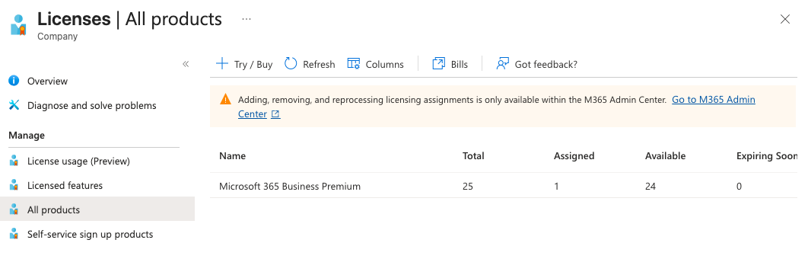
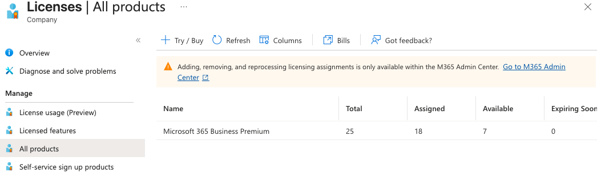

# Part 2 — Hybrid Cloud Integration (Entra ID)

### Overview
This section documents the cloud portion of the project, where on-premises Active Directory identities are synchronized to Microsoft Entra ID and prepared for Microsoft 365 services using Microsoft Graph.

The goal was to ensure that users provisioned in Active Directory automatically exist in the cloud and are ready for service access without manual intervention. 
Getting there required solving two problems: a synchronization failure caused by clock drift and a licensing failure caused by a missing required attribute. 
Both are documented below.

## Table of Contents
- [Phase 1 — Identity Synchronization (Entra Connect)](#phase-1--identity-synchronization-entra-connect)
- [Phase 2 — Cloud Lifecycle Automation (Microsoft Graph)](#phase-2--cloud-lifecycle-automation-microsoft-graph)
- [Outcome & Results](#outcome--results)

---

## Phase 1 — Identity Synchronization (Entra Connect)

Following the on-premises setup, the next step was extending the local directory to the cloud.

### Microsoft Entra Connect Configuration

Microsoft Entra Connect Sync was downloaded and installed on the Windows Server 2022 Domain Controller. During setup, OU-scoped filtering was configured to sync only the `Corporate` OU rather than the entire directory.





Filtering to a specific OU prevents built-in system accounts and local infrastructure groups from appearing in the cloud tenant. This is a standard practice 
in production hybrid environments to keep the cloud directory clean and the on-premises AD as the authoritative source.

---

### Troubleshooting - Synchronization Failure (NTP Time Skew)

The first sync attempt failed. Users were not appearing in the Entra ID tenant.

**Root cause:** The local VM system clock had drifted from real time. Entra ID authentication tokens have strict time-validation requirements. Even a small clock skew is enough to cause the sync agent's authentication to fail, which prevents user objects from syncing.

**Resolution:** Reconfigured the Windows Time service to pull from an external NTP source instead of the local CMOS clock:

```powershell
w32tm /config /manualpeerlist:"time.windows.com,0x8" /syncfromflags:manual /update
Restart-Service W32Time
w32tm /resync /force
```

After forcing a time resync, the next synchronization cycle completed successfully. In a hybrid environment time synchronization is a strict dependency, even a small drift can invalidate security tokens and break the identity pipeline between on-premises and cloud.

---

### Verification of Cloud Identities

After the NTP fix, 18 users appeared in the Entra ID All Users view, each marked as **Synced from on-premises**, confirming that on-premises AD remains the Source of Authority. All 18 were in an unlicensed state, requiring a second phase to activate cloud services.



---

## Phase 2 — Cloud Lifecycle Automation (Microsoft Graph)

### Establishing the Graph Connection 

Cloud identity management in Entra ID is API-driven. Before any provisioning could happen, an authenticated session to the tenant was established through the Microsoft Graph PowerShell module using delegated permissions scoped to only what was needed:

```powershell
Connect-MgGraph -Scopes "User.ReadWrite.All", "Organization.Read.All" `
    -ContextScope Process -UseDeviceAuthentication
```

Scopes were restricted to user and directory modifications only — no broader tenant permissions than the task required.




---

### Troubleshooting — License Assignment Failure (400 BadRequest)

With 18 unlicensed users in the tenant, a manual license assignment was attempted first to establish a working baseline before scripting anything.

The command failed immediately with a `400 BadRequest`.

**Root Cause:** Microsoft 365 requires the `UsageLocation` attribute (ISO country code) to be set on a user object before a license can be assigned. The synced user objects didn't have this attribute populated because it wasn't set in the on-premises AD.

The fix was validated manually on a single user before scripting:

```powershell
Update-MgUser -UserId  -UsageLocation "CA"
Set-MgUserLicense -UserId  -AddLicenses @{SkuId = $LicenseID} -RemoveLicenses @()
```

**Identity → Attribute Remediation → License Assignment → Service Access**



---

### Single-User Provisioning Script

**Script:** `01-cloud-single-user-joiner.ps1` 

Once the fix was validated manually, it was moved into a reusable script with error handling to make the process repeatable for any individual user.

```powershell
# See full script for Read-Host input handling and try/catch block
```

 

Prompting for one user at a time works for targeted remediation but doesn't scale. With 18 users to process and potentially many more in a real environment, a bulk approach was needed.

---

### Bulk Provisioning Engine

**Script:** `02-cloud-bulk-joiner.ps1`

The final iteration removes the manual input entirely. Instead of prompting for a user, the script queries the tenant directly for all users where `assignedLicenses/count eq 0` and processes them in one pass:


```powershell
$TargetUsers = Get-MgUser -Filter "assignedLicenses/`$count eq 0" `
    -ConsistencyLevel eventual -CountVariable unlicensedCount

foreach ($User in $TargetUsers) {
    try {
        Update-MgUser -UserID $User.Id -UsageLocation "CA"
        Set-MgUserLicense -UserID $User.Id -AddLicenses @{SkuId = $LicenseID} `
            -RemoveLicenses @()
    } catch {
        Write-Host "Failed to license user: $($User.UserPrincipalName): $($_.Exception.Message)"
    }
}
```
A failure on one account is caught and logged without stopping the rest of the batch. The script identifies its own workload, applies the fix, and handles errors. No human in the loop.

[View script](scripts/02-cloud-bulk-joiner.ps1) 


---

## Outcome & Results

A full provisioning cycle was run across all 18 synchronized users.

- All 18 transitioned from Unlicensed to Active
- `UsageLocation` confirmed as CA across the entire tenant
- Exchange Online and SharePoint Online access enabled for all accounts




---

