# Part 3: Governance and Security

## Overview

After completing the identity lifecycle and hybrid provisioning workflows, the final phase focuses on securing and reviewing those identities.With users provisioned and synchronized across both environments, the remaining questions are: who can access what, under what conditions, and is that access still appropriate over time?

This phase covers three areas:
- Zero Trust access enforcement using Conditional Access and Intune
- SSO integration through SAML 2.0
- Identity governance through automated PowerShell audit reporting

---

## Table of Contents

- [Phase 1 — Zero Trust Access Enforcement](#phase-1--zero-trust-access-enforcement)
- [Phase 2 — SSO Integration (SAML 2.0)](#phase-2--sso-integration-saml-20)
- [Phase 3 — Identity Governance & Risk Review](#phase-3--identity-governance--risk-review)
- [Outcome & Results](#outcome--results)


---


## Phase 1 - Zero Trust Access Enforcement

### Baseline MFA Policy

The first control was a global Conditional Access policy enforcing MFA across all cloud applications for all users:

  ```
  User = All Users
  App = All Cloud Apps
  Grant Access =  Require MFA
  ```
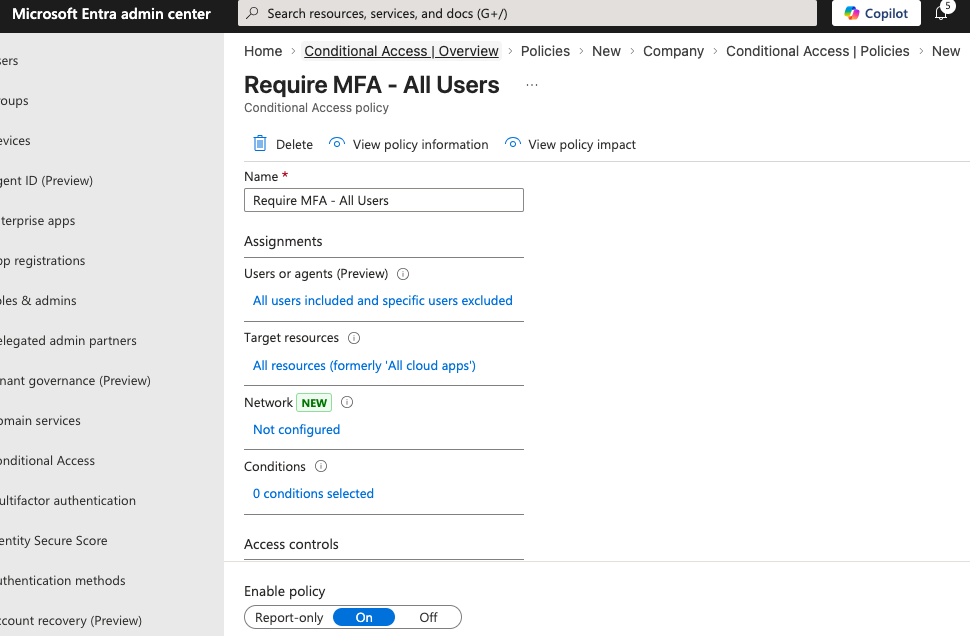

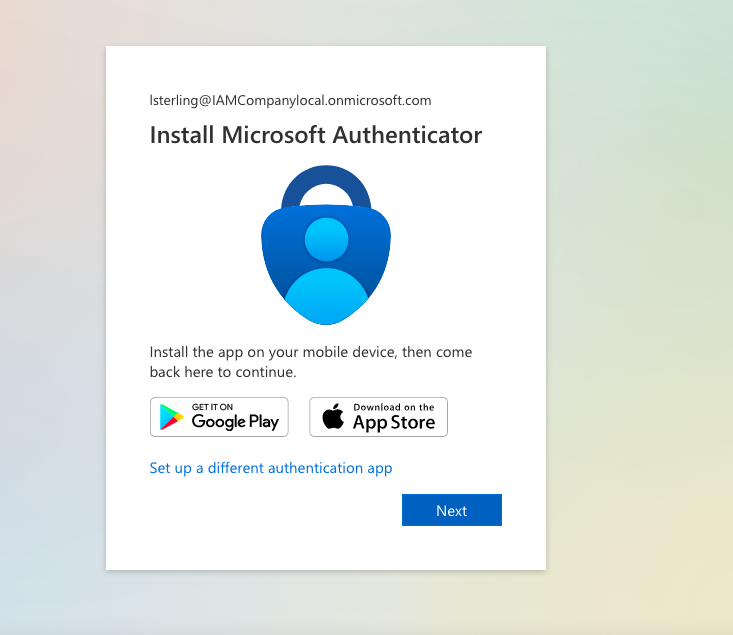


This establishes the baseline that valid credentials alone are not sufficient for access.

---  
  
### SharePoint RBAC Structure

Before applying Conditional Access to SharePoint, access was structured using role-based group assignment to ensure permissions are granted by role and not by individual, staying consistent with the AGDLP model from Part 1.

- `Finance_Analyst` (Global Group) → Members (edit access)
- `Finance_Manager` (Global Group) → Owners (full control)

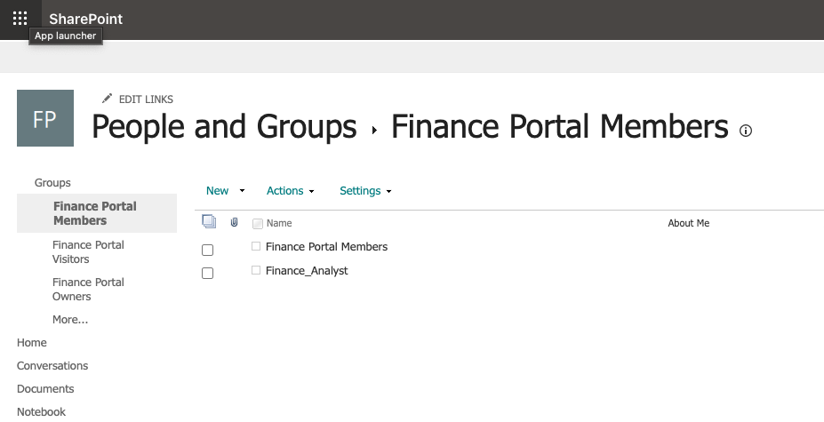
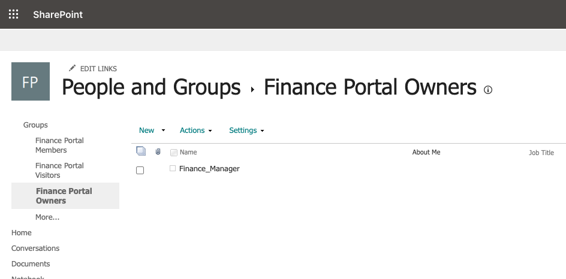

---

### Stricter Policy for SharePoint

MFA protects identity but doesn't protect against access from unmanaged or compromised devices. A separate Conditional Access policy was created specifically for SharePoint Online requiring both MFA and a compliant device:

```
User     = All Users
App      = SharePoint Online
Grant    = Require MFA
          + Require device marked as compliant
```

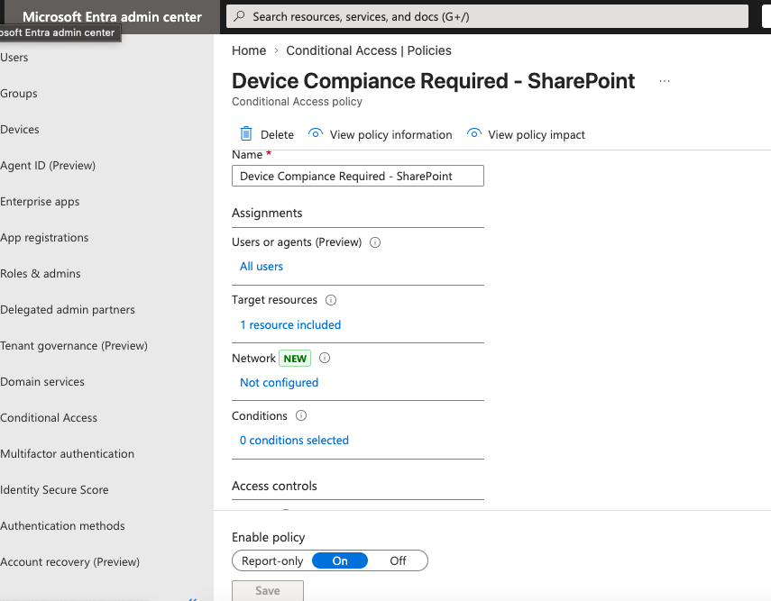

---

### Troubleshooting — Intune Lockout and Break-Glass Solution

After applying the policy, an access failure occurred immediately. Attempting to open SharePoint triggered an Intune Company Portal registration prompt.


Attempting to register the device failed. The software version did not meet the Intune compliance requirement. The result was a lockout from both SharePoint and the M365 Admin Center which were enforced by the same policy that was just configured.


**Resolution — Break-Glass Exclusion Group**

A Security Group named `Admin-Exclude` was created and added as an exclusion to both the SharePoint and baseline MFA Conditional Access policies. The admin account was then added to this group, restoring administrative access without removing the enforcement from regular users.


Break-glass accounts are a standard enterprise control tool for this exact scenario. If a primary identity provider fails, an MFA 
service goes down, or a policy is misconfigured, these accounts ensure the organization isn't permanently locked out of its own tenant. This 
situation enforced that requirement rather than remain theoretical.

The `Admin-Exclude` group was applied to the baseline MFA policy as a secondary precaution, ensuring administrative access is never fully blocked by a misconfigured policy.

---

### Intune Compliance Policy

To support the device compliance requirement, compliance standards were defined in Intune. Only devices meeting all three conditions are considered trusted:

**Compliance Requirements:**

| Requirement | Purpose |
|-------------|---------|
| Password: Minimum 8 characters | Prevent brute-force attacks |
| Microsoft Defender Antimalware enabled | Prevent unmanaged or non-compliant devices from entering the environment |
| Firewall enabled | Protect the endpoint in untrusted network environments |

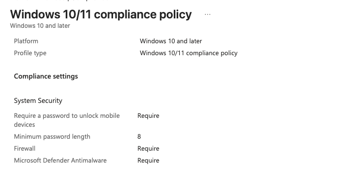
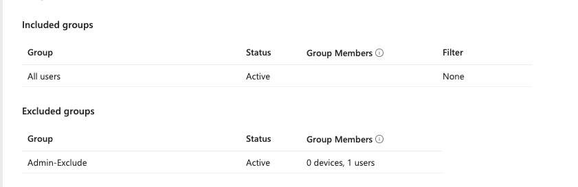

---

### Enforcement Model

Access to SharePoint is only granted when all three conditions are 
satisfied simultaneously:

```
User Identity (MFA verified)
+
Device State (Compliant via Intune)
+
Resource Policy (SharePoint Conditional Access)
```

This is the Zero Trust model in practice: verify identity, verify device, enforce resource policy for every request, every time.

---

## Phase 2 — SSO Integration (SAML 2.0)

### Overview

With access controls enforcing MFA and device compliance, the next step was enabling authentication across enterprise applications without requiring separate credentials for each one.

A custom SAML 2.0 application was configured in Entra ID to demonstrate how external applications are integrated through a centralized identity provider. SAML remains the dominant protocol for enterprise SaaS integrations and legacy systems regardless of OIDC's growth in modern application development.

---
### Application Configuration

| Field | Value | Purpose |
|-------|-------|---------|
| Identifier (Entity ID) | `https://saml-test-app.com` | Uniquely identifies the application to Entra ID |
| Reply URL (ACS URL) | `https://jwt.ms` | Endpoint where Entra ID sends the SAML assertion |


The Reply URL was set to `https://jwt.ms` to allow assertion validation without requiring a live application backend.

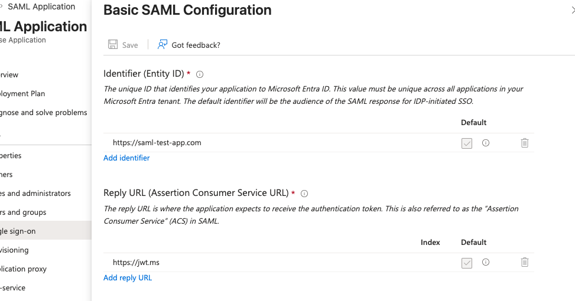


### Group-Based Access Assignment

Following the AGDLP model, access was granted through group membership rather than individual assignment. `Marketing_Staff_GG` was assigned to the application, meaning any user synced from the on-premises Marketing OU automatically receives SSO access — no manual assignment required as the workforce scales.

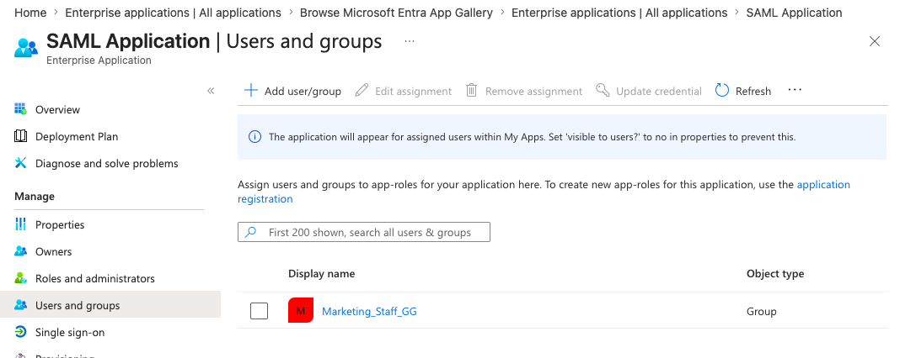

---

### Assertion Validation

SAML Tracer was used to capture and inspect the SAML response in transit.

The application was confirmed appearing in the user's My Apps portal, confirming the Entra ID assignment was active.

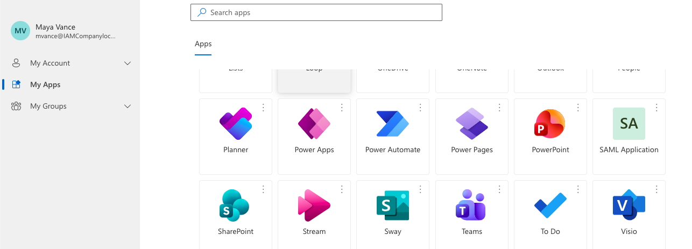

The SAML assertion was then intercepted and validated:

|Element | Status | Validation |
|--------|--------|------------|
| Issuer | PASS | Matched Entra ID tenant (sts.windows.net) |
| Subject | PASS | Correct user confirmed (mvance@IAMCompanylocal.onmicrosoft.com) |
| AttributeStatement | PASS |  givenname, surname, and email mapped correctly |


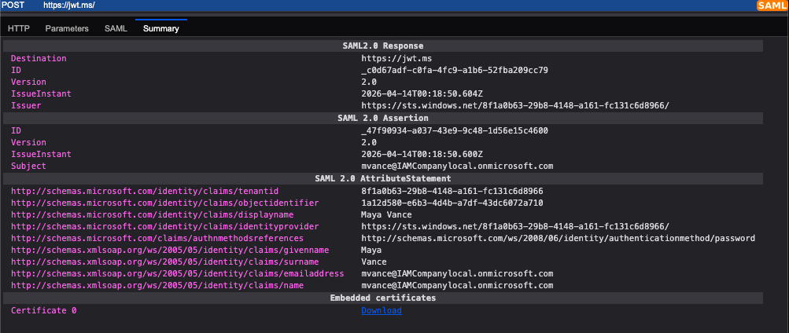

---

### Troubleshooting — No Backend Application

The test application has no actual backend service to receive the SAML response. The SAML assertion is successfully generated by Entra ID and 
the authentication handshake completes, but the final delivery fails because nothing is listening at the Reply URL. Additionally, `jwt.ms` 
is optimized for OIDC/JWT tokens and doesn't decode the XML packets used by SAML.

This is an expected lab constraint, however the meaningful validation that Entra ID correctly issued a signed assertion with the right issuer, subject, and attributes was confirmed through SAML Tracer before the delivery step.


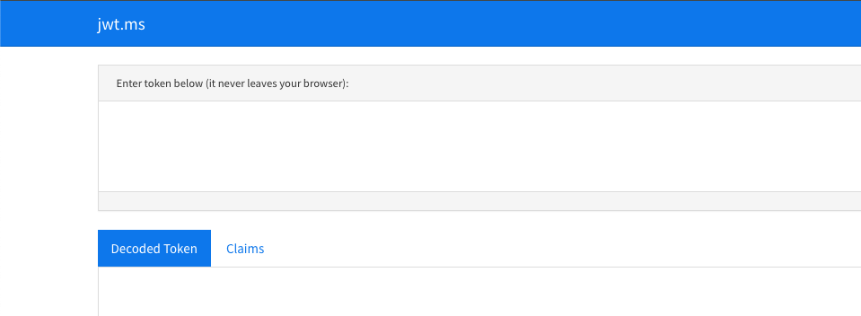

---

## Phase 3 — Identity Governance & Risk Review

### Overview 

After lifecycle automation and access controls were in place, users were being created, moved, and licensed correctly but there was no visibility into what happened to access after provisioning. This phase builds that visibility through four PowerShell scripts, each one identifying a gap in the previous and extending the governance model.

---

### Script 1 — Inactive Account Detection

**Script:** `01-InactiveUser.ps1` 

The starting point was a basic inactivity audit using `LastLogonDate`:

```powershell
if ($ActualDays -ge $RiskThreshold) {
    "Risk: Account inactive for more than $RiskThreshold Days"
}
```
[View script](scripts/01-InactiveUser.ps1)

This showed stale accounts that should be reviewed or disabled.

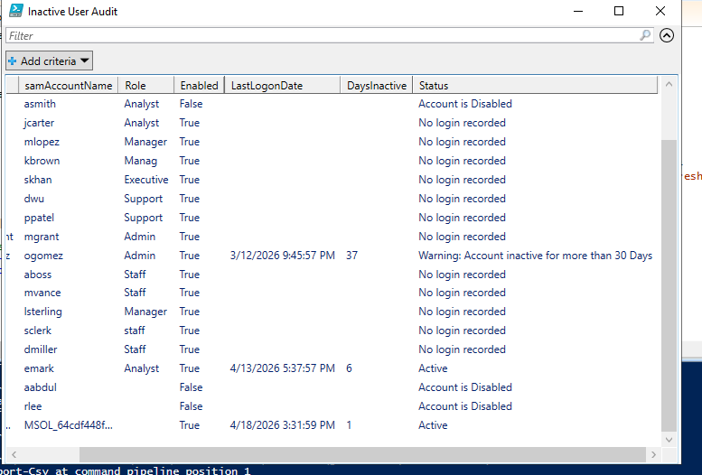

**Limitation:** The script treated all inactive accounts equally. It didn't distinguish between a standard user who hadn't logged in recently and a privileged account with elevated access sitting idle. Both scenarios carry very different levels of risk, and the output gave no guidance on what action should follow.

---

### Script 2 — Privileged Access Classification

**Script:** `02-inactive_privileged_User.ps1`

The script was extended to check each user's group membership against a defined privileged group (`IT_Admin_GG`) and assign risk classification accordingly:

```powershell
if ($PrivilegedGroups -contains $GroupName) {
    $GroupName
}
```
[View script](scripts/02-inactive_privileged_User.ps1)

The output now separated inactive standard accounts from inactive privileged accounts and assigned different risk levels and recommended actions to each. Privileged access is determined by membership in `IT_Admin_GG`. Inactivity is evaluated using `LastLogonDate`, which is the threshold used this lab.

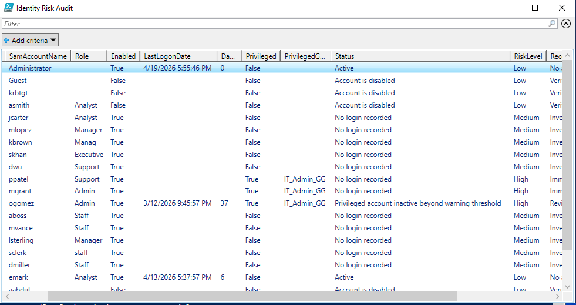

[View Report](Reports/identity-risk-audit.xlsx)
      

***Note:***
Privileged access in this environment is determined by membership in the IT_Admin_GG group.

---

### Script 3 — RBAC Drift Detection

**Script:** `scripts/03-rbacDrift.ps1`


With risk classification in place, the next question was whether users still had the right access. The RBAC drift script compared each user's Department and Title attributes against their current group memberships:

```powershell
if (-not ($Groups | Where-Object { $_ -like "*$Department*" })) {
    $AccessStatus = "Drift"
}
```

[View script](scripts/03-rbacDrift.ps1)


If both department and role appeared in the user's group names, access was considered aligned. If not, the account was flagged as access drift.

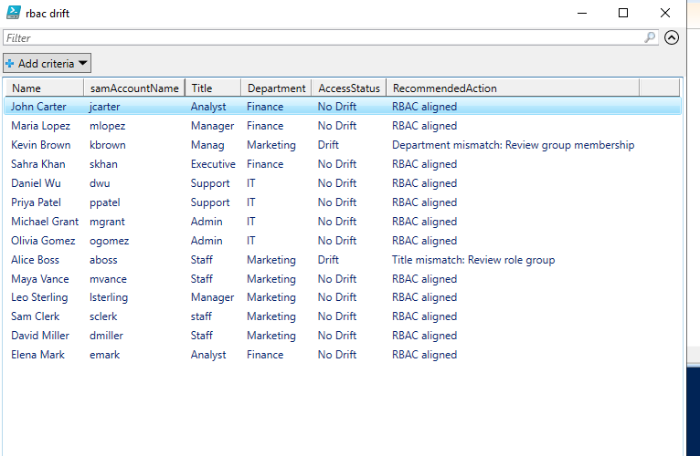
[View Report](Reports/rbac-drift-audit.xlsx)
 

**Limitation:** The script confirmed whether users had the 
correct access but didn't check whether they had additional access beyond what their role required. A user could pass the RBAC check 
while still holding group memberships accumulated from a previous role.

---

### Script 4 — Permission Creep Detection

**Script:** `scripts/04-AccessDrift.ps1`

Another problem became clear when reviewing `ppatel` in an audit report. The RBAC drift detection output marked them 
as No Drift because their department and role matched correctly. But looking closley at their actual group memberships showed an additional group that had nothing to do with their current role.

The script was again extended to flag unexpected group memberships:

```powershell
$UnexpectedGroups = $Groups | Where-Object { $_ -notlike "*$Title*" }
```

[View Script](scripts/04-AccessDrift.ps1)

The detection model now covered three checks:
1. Department alignment — does the user have access for their department?
2. Role alignment — does the user have access for their title?
3. Unexpected access — does the user have access beyond what their role requires?

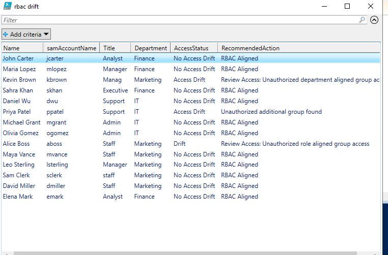

[View Report](Reports/access-drift-audit.xlsx )


**Design note:** This script uses string matching against the Title attribute to identify unexpected groups. This approach depends entirely on consistent group naming conventions and will produce false positives for baseline groups like Domain Users that don't contain the title string. In a production environment this would be replaced with an explicit allow-list of expected groups per role, or a defined RBAC mapping table, rather than pattern matching. For this lab string matching was used to demonstrate 
the underlying detection logic clearly.

---
## Outcome & Results

This phase implemented the full governance and security layer across the hybrid environment.

**Zero Trust enforcement** — MFA enforced, device compliance enforced for SharePoint, break-glass exclusion group protecting administrative access from policy misconfiguration.

**SSO integration** — SAML 2.0 application configured in Entra ID, group-based assignment maintaining the RBAC model, assertion validated through SAML Tracer confirming issuer, subject, and attribute mapping.

**Identity governance** — Four scripts providing visibility across:
- Inactive account detection
- Privileged access risk classification
- RBAC alignment validation
- Permission creep detection

Output in a structured CSV audit report covering all four dimensions.

---

### Production Context

In a production environment, this governance layer would be handled by an IGA platform such as SailPoint IdentityNow. These platforms automate access reviews, route flagged accounts for human certification, and enforce remediation workflows at scale.

This implementation replicates the underlying logic of identifying access controls, detecting misalignment and excess access, classifying risk, 
and producing a reviewable dataset to demonstrate the core governance principles those platforms operationalize.
