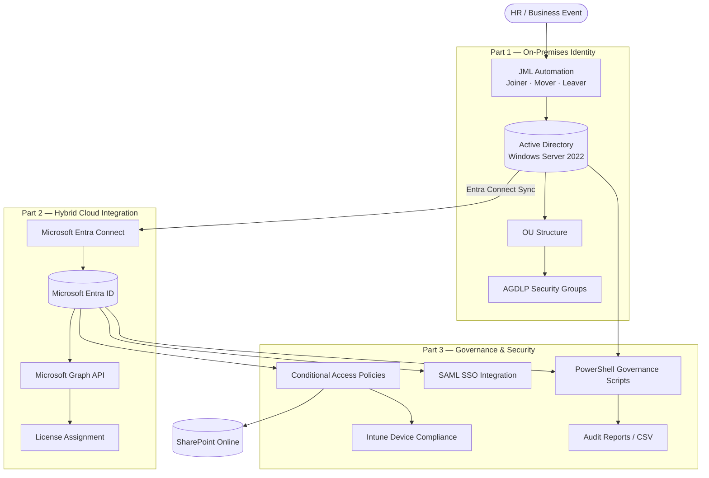
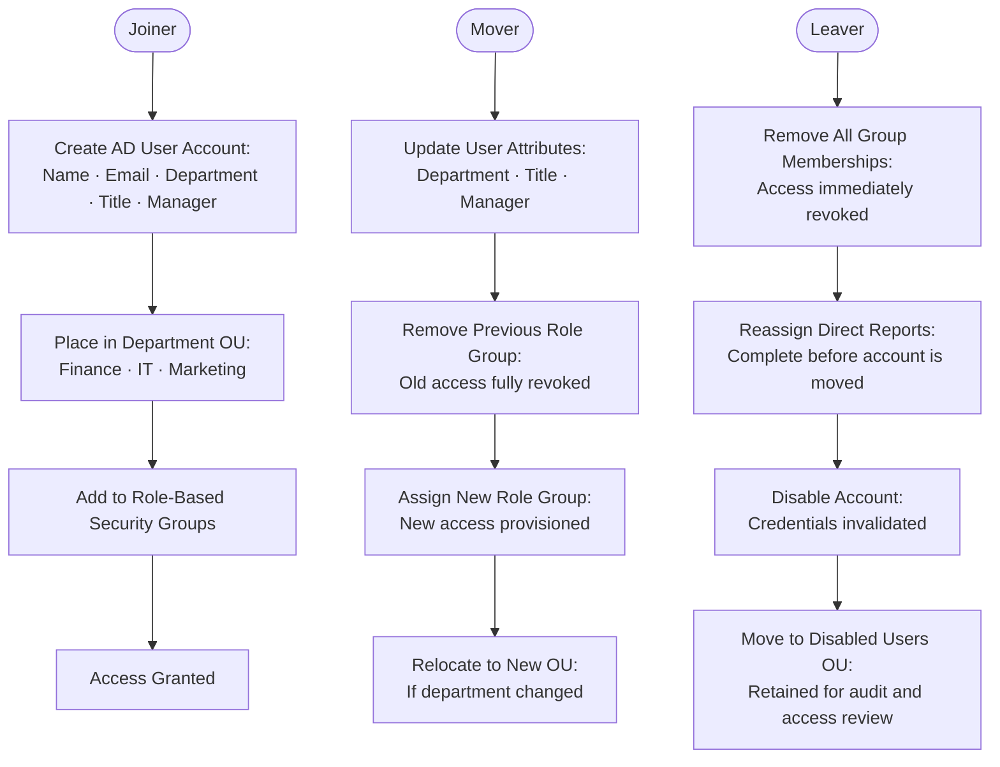
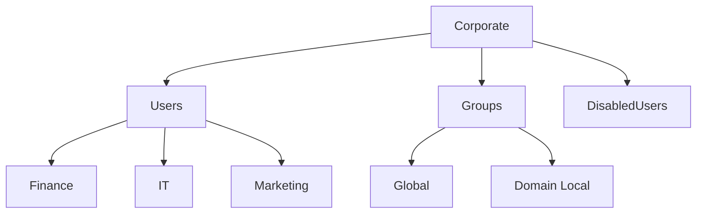

# Hybrid Identity Lifecycle Automation Lab

## Active Directory, Microsoft Entra ID, Microsoft Graph, and Identity Governance

---

### Project Overview

This project mirrors the onboarding, provisioning, licensing, and offboarding activities that Service Desk, IT Operations, and Identity Administration teams handle daily in Microsoft hybrid environments.

It was built iteratively rather than designed upfront. Each phase hit a real limitation that made the next one necessary. The goal wasn't just to create users, it was to manage their full lifecycle, control access, enforce security, and maintain the kind of governance visibility that enterprise IAM environments actually require.

The environment uses Windows Server 2022, Active Directory, PowerShell, Microsoft Entra ID, Microsoft Graph, Microsoft Entra Connect, and Microsoft Intune.

---

### System Architecture

*Hybrid identity environment spanning on-premises Active Directory, Microsoft Entra ID, and cloud governance built in three phases*

*Automated Joiner, Mover, and Leaver lifecycle covering account provisioning, role transitions, and secure offboarding*

*Active Directory OU design using department-based RBAC and AGDLP group nesting*

---

## Table of Contents

**Project Sections**
- [Part 1 — On-Premises Infrastructure & Lifecycle](01-On-Prem-Infrastructure/README.md)
- [Part 2 — Hybrid Cloud Integration](02-Cloud-Automation/README.md)
- [Part 3 — Governance & Security](03-Governance-Compliance/README.md)

**Overview**
- [Part 1 — On-Premises Summary](#part-1--on-premises-infrastructure--lifecycle)
- [Part 2 — Cloud Integration Summary](#part-2--hybrid-cloud-integration)
- [Part 3 — Governance & Security Summary](#part-3--governance--security)
- [Project Structure](#project-structure)
- [Technical Skills](#technical-skills)

---

## Part 1 — On-Premises Infrastructure & Lifecycle

[Full detail → Part 1 README](01-On-Prem-Infrastructure/README.md)

The project started with building a structured Active Directory environment from scratch. Departmental OU hierarchy, RBAC through the AGDLP model, and JML automation covering the full Joiner, Mover, and Leaver workflow.

Early scripts were functional but hardcoded and not reusable. Each iteration identified that limitation and solved it, moving from manual creation to parameterized, loop-based automation.

One real problem surfaced during development: moving a user object in AD changes their Distinguished Name immediately, which broke downstream operations that 
referenced the old DN. The fix required rethinking execution order, which was reassigning subordinates before moving the object, instead of after. Working through that issue reinforced how important execution order is when automating changes in Active Directory.

**Key concepts covered:** OU design, AGDLP, JML automation, least privilege enforcement, referential integrity, PowerShell parameterization

---

## Part 2 — Hybrid Cloud Integration

[Full detail → Part 2 README](02-Cloud-Automation/README.md)

With the on-premises foundation stable, the next step was extending identities into Microsoft Entra ID.

Entra Connect was configured with OU-scoped filtering to sync only the Corporate OU to keep the cloud tenant clean. The first sync attempt failed due to time skew between the VM clock and Entra ID's authentication tokens. Fixing the NTP configuration resolved it.

After the sync, 18 users existed in the cloud but were unlicensed. The initial license assignment attempt failed with a `400 BadRequest`. The root cause was a missing `UsageLocation` attribute. Microsoft 365 requires it before a license can be assigned.

That fix was first validated manually, then automated for a single user before being expanded into a bulk provisioning script that automatically identifies all unlicensed  users and processes them in one execution.

**Key concepts covered:** Hybrid identity sync, Entra Connect, Microsoft Graph API, delegated permissions, bulk provisioning automation, dependency sequencing

---

## Part 3 — Governance & Security

[Full detail → Part 3 README](03-Governance-Compliance/README.md)

With identities provisioned across both environments, the focus shifted to access control and governance visibility.

**Zero Trust enforcement** — Conditional Access policies were implemented in Entra ID to require MFA across all applications, with a stricter policy applied to SharePoint requiring both MFA and a compliant device via Intune. During testing, my macOS failed the Intune compliance check. My macOS did not meet the Intune compliance requirement, causing a lockout. This led to implementing a break-glass exclusion group, which is a standard enterprise resilience control.

**SSO integration** — A SAML 2.0 application was configured in Entra ID with group-based access assignment. The SAML assertion was validated using SAML Tracer, confirming the issuer, subject, and attribute mappings were correct.

**Identity governance** — Four PowerShell scripts were built in sequence, each addressing a gap the previous one exposed:

1. Inactive account detection using `LastLogonDate` thresholds
2. Privileged access classification by group membership — separating standard 
   and elevated accounts
3. RBAC drift detection — validating whether user access matched their department 
   and role
4. Permission creep detection — flagging group memberships beyond what the role 
   requires

The final output is a CSV report that consolidates inactive accounts, privileged accounts, RBAC drift, and permission creep into a single governance report. In production, this data layer is what IGA platforms like SailPoint IdentityNow operationalize through automated certification campaigns and remediation workflows.

**Key concepts covered:** Zero Trust, Conditional Access, Intune device compliance, break-glass accounts, SAML 2.0, identity governance, access reviews, privilege management, IGA concepts

---

## Project Structure

| Part | Focus | Key Technologies |
|------|-------|-----------------|
| [Part 1](01-On-Prem-Infrastructure/README.md) | AD build, RBAC, JML automation | Windows Server 2022, Active Directory, PowerShell |
| [Part 2](02-Cloud-Automation/README.md) | Hybrid sync, cloud provisioning | Entra ID, Entra Connect, Microsoft Graph |
| [Part 3](03-Governance-Compliance/README.md) | Access control, SSO, governance | Conditional Access, Intune, SAML, PowerShell |

---

## Technical Skills

**Identity & Access Management**
- Identity lifecycle automation — Joiner, Mover, Leaver (JML)
- Role-Based Access Control (RBAC) using AGDLP model
- Least privilege enforcement and permission creep prevention
- Hybrid identity synchronization (on-premises AD as Source of Authority)
- Privileged access identification and risk classification

**Cloud & Modern Authentication**
- Microsoft Entra ID — user provisioning, group management, licensing
- Microsoft Graph API — delegated permissions, bulk provisioning automation
- Entra Connect — OU-scoped sync filtering, NTP troubleshooting
- SAML 2.0 SSO — application configuration, assertion validation

**Security & Zero Trust**
- Conditional Access policy design — baseline MFA and resource-scoped policies
- Device compliance enforcement via Microsoft Intune
- Break-glass and emergency access account strategy
- Zero Trust access model — identity + device + resource context

**Identity Governance**
- Inactive account detection using `LastLogonDate` thresholds
- Privileged access review through group membership analysis
- RBAC drift detection — validating access alignment against role and department
- Permission creep detection — flagging unexpected group memberships
- Governance report generation via CSV export
- IGA platform concepts — access certification, entitlement review, risk classification

**PowerShell & Automation**
- Parameterized and modular script design
- Try/Catch error handling and pipeline processing
- Iterative development from hardcoded scripts to reusable automation engines
- Microsoft Graph PowerShell module
- Active Directory PowerShell module

---

*All automation was developed and tested in an isolated lab environment. Each phase includes screenshots and documentation to demonstrate the implementation, troubleshooting process, and final results available in the respective part directories.*
